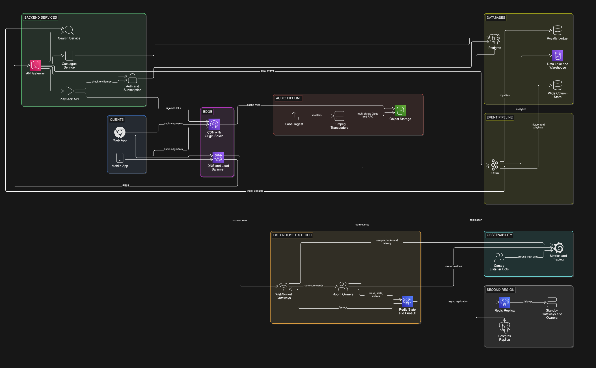
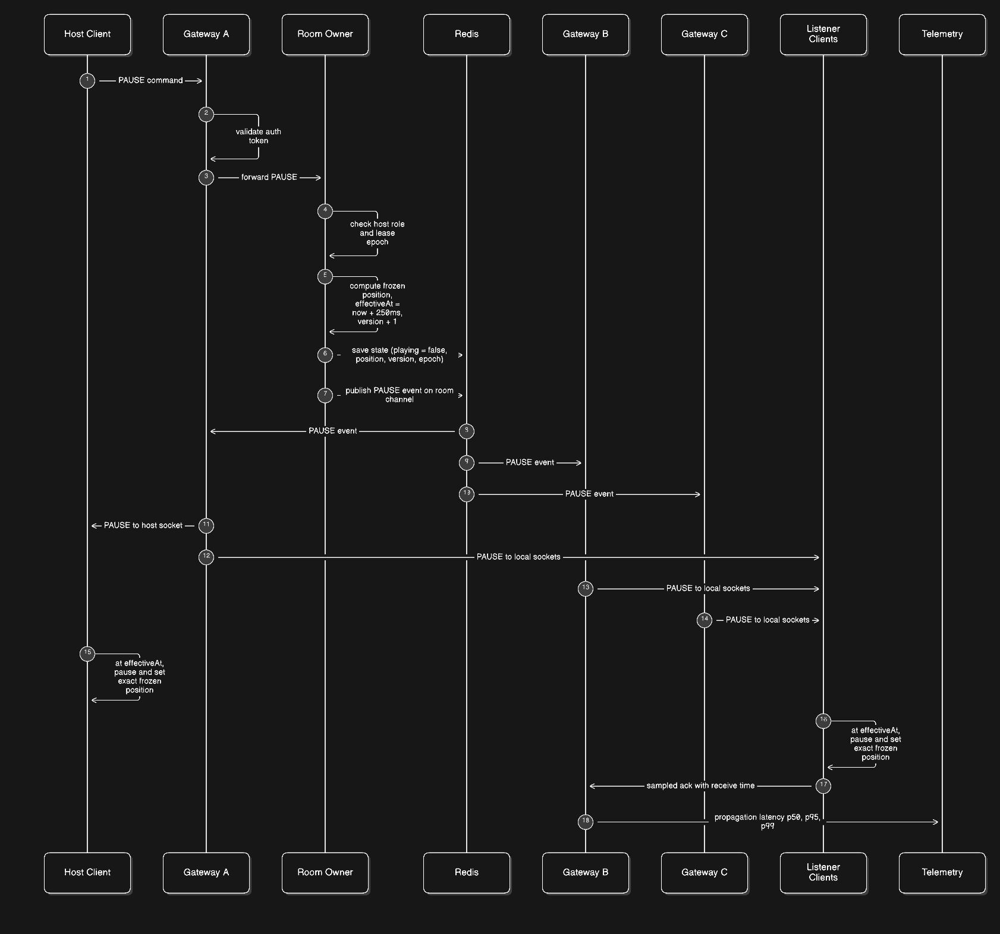

# Music Streaming with Shared Listening Rooms: Backend and Architecture

Design for a Spotify-style streaming service with shared listening rooms. Scope: audio delivery, catalogue and search, room sync, storage, reliability, and observability.

## Deliverables

* **Architecture and Sequence Diagrams**:
  * **System Architecture**: [Architecture.png](Architecture.png)
    
  * **Sequence Diagram ("Host presses pause in a room of 5,000 listeners")**: [Sequence.png](Sequence.png)
    
  * **Interactive Diagrams**: [View Live on Eraser.io](https://app.eraser.io/workspace/xFkEmkIdv0Ki2QaxZUye?origin=share)

* **Design Document (3 to 6 pages)**:
  * **PDF Document**: [Design-Doc.pdf](Design-Doc.pdf) (5 pages)
  * **Word Document Source**: [Listen Together Music Streaming Design.docx](Listen%20Together%20Music%20Streaming%20Design.docx)
